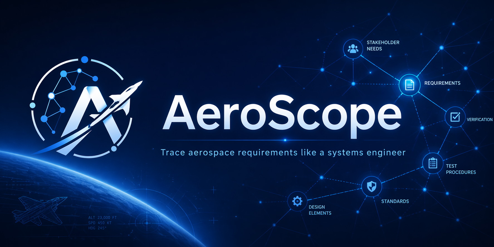
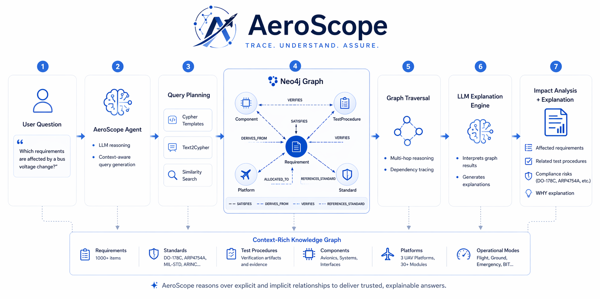
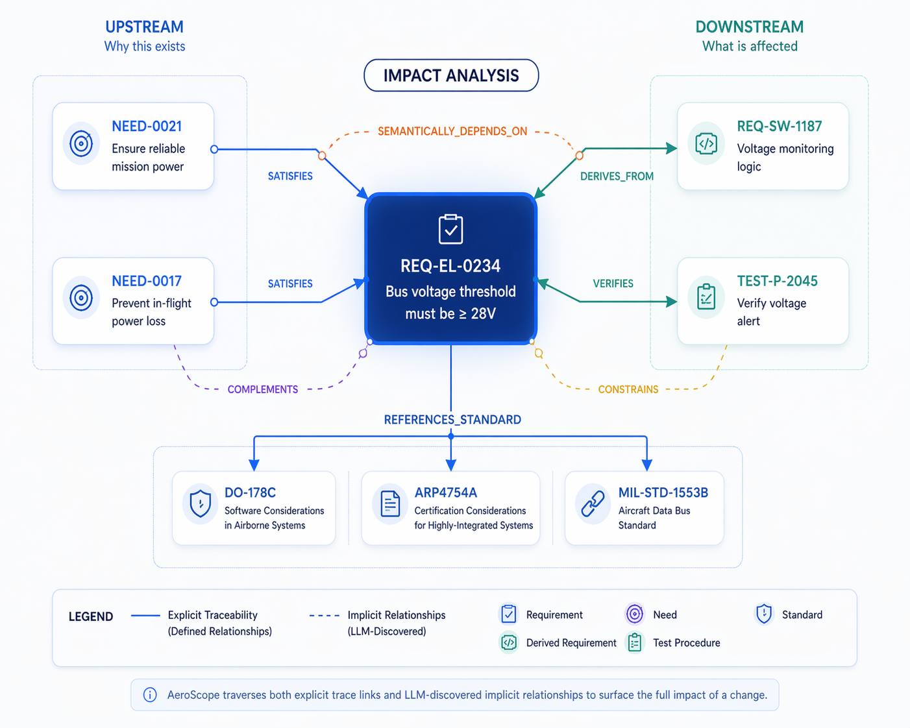

<p align="center">
  
</p>

<h1 align="center">AeroScope</h1>

<p align="center">
  <strong>Trace. Understand. Assure.</strong><br/>
  An aerospace requirements traceability agent on Neo4j Aura — walk the graph, explain the impact.
</p>

<p align="center">
  <a href="https://neo4j.com/"></a>
  <a href="https://nextjs.org/"></a>
  <a href="https://supabase.com/"></a>
  <a href="LICENSE"></a>
</p>

---

## Live demo

**https://aeroscope-neo4j-hackathon.vercel.app**

Create an account with email and password — auth is handled by Supabase. New users click "Need an account? Create one" on the login screen to sign up.

---

## What it does

AeroScope reasons over aerospace requirements the way an experienced systems engineer would. Ask it something like *"Which safety-critical requirements depend on the bus voltage threshold we're about to change?"* and it walks the graph — finding the target requirement, tracing upstream to stakeholder needs, downstream to test procedures, flagging the standards it must comply with (DO-178C, ARP4754A, MIL-STD-1553B), and surfacing implicit dependencies an LLM discovered offline. Every answer comes with the Cypher that produced it, so you can see *why* each connection matters rather than trusting a black box.

Requirements engineering is nothing but relationships — `SATISFIES`, `DERIVES_FROM`, `VERIFIES`, `REFERENCES_STANDARD`, `ALLOCATED_TO`. Document search can find *a* requirement; only a graph can answer *"what breaks if I change this one?"*. AeroScope pairs a curated Cypher-template toolbox for predictable traces (impact analysis, coverage, orphan detection) with a free-form Text2Cypher escape hatch for exploratory questions, all grounded in a ~1,000-requirement synthetic corpus across 30 modules and four fictional UAV platforms (Stratos-7, AeroLynx-X2, Skyrunner-T1, Nimbus-C3).

---

## How AeroScope thinks

<p align="center">
  
</p>

A question like *"Which requirements are affected if we change the 28V undervoltage threshold?"* walks through seven stages: the agent plans the right tool (Cypher Template, Text2Cypher, or Similarity Search), runs it against a context-rich knowledge graph (1,000+ requirements, 20+ standards, 14 relationship types, components, platforms, operational modes), traces multi-hop dependencies, and the LLM explains *why* each connection matters — affected requirements, tests that must rerun, compliance risks, and a written justification. The graph surfaces both explicit relationships and LLM-discovered implicit ones; explanations are grounded in the Cypher that produced them.

---

## Impact Analysis: What Breaks If This Changes?

<p align="center">
  
</p>

Pick any requirement and AeroScope fans out in both directions. **Upstream**, it answers *why this requirement exists* — the stakeholder needs it satisfies. **Downstream**, it answers *what is affected if it changes* — the monitoring logic that derives from it, the tests that verify it, the components it constrains, and the standards it references. The same traversal surfaces both the explicit trace links that engineers wrote by hand and the implicit `SEMANTICALLY_DEPENDS_ON` edges an LLM inferred offline, so a change-control board can see the full blast radius — not just the links that happened to be typed into DOORS.

---

## How it works

- **Next.js 14 App Router** web UI renders the dashboard, query console, and traceability views.
- **`/api/query`** serverless route (Node runtime, `fra1` region) accepts a `template_id` + params, loads the matching whitelisted Cypher from `aura/cypher_templates/*.json`, and runs it against Neo4j Aura.
- **Cypher templates as a whitelist** — the server will not execute arbitrary Cypher from the client; every template is version-controlled in the repo.
- **Supabase auth** (email/password) gates `/dashboard/*` via Edge middleware that refreshes the session cookie on every request.
- **Python pipeline** (dev-only, not deployed) generates the synthetic corpus, loads it to Aura, enriches relationships, and caches embeddings.

```
browser ── /dashboard ──┐
                        ├── Edge middleware (Supabase session)
                        ▼
                  Next.js page ── fetch /api/query ──► Node serverless (fra1)
                                                         │
                                                         ├── whitelist lookup
                                                         │   (aura/cypher_templates/*.json)
                                                         │
                                                         └── neo4j-driver ──► Neo4j Aura
```

---

## Tech stack

- **Frontend:** Next.js 14 (App Router), React 18, TypeScript, Tailwind CSS
- **Runtime:** Node 20 serverless functions on Vercel (region `fra1`)
- **Database:** Neo4j Aura (EU region recommended to keep latency with `fra1`)
- **Auth:** Supabase (`@supabase/ssr`) — email/password, cookie-based sessions refreshed in Edge middleware
- **Python pipeline:** Python 3.9+, `neo4j-driver`, `openai` for corpus generation and enrichment

---

## Local dev

```bash
# 1. Copy env template and fill in credentials
cp .env.example .env.local
# Edit .env.local — set:
#   NEO4J_URI, NEO4J_USER, NEO4J_PASSWORD
#   NEXT_PUBLIC_SUPABASE_URL, NEXT_PUBLIC_SUPABASE_PUBLISHABLE_KEY
#   OPENAI_API_KEY (only if you will regenerate the corpus)

# 2. Install and run
npm install
npm run dev
# open http://localhost:3000 — click "Sign in"
```

Other scripts:

```bash
npm run build         # production build
npm run start         # serve the production build
npm run scrub-check   # guardrail — fails if proprietary names sneak in
```

### Supabase setup

1. Create a free project at <https://supabase.com/>.
2. In **Project Settings → API**, copy the **Project URL** into `NEXT_PUBLIC_SUPABASE_URL` and the **Publishable key** into `NEXT_PUBLIC_SUPABASE_PUBLISHABLE_KEY`.
3. In **Authentication → Providers → Email**, keep Email enabled. If you want sign-up to be instant (no confirmation email), toggle **Confirm email** off for the hackathon demo.
4. In **Authentication → URL Configuration**, add `http://localhost:3000` and your Vercel URL to the **Site URL** / **Redirect URLs** allowlist so the confirmation emails (if enabled) point back to the right place.

---

## Python pipeline

A supporting Python pipeline generates the synthetic corpus and loads it into Aura. It is **not** deployed to Vercel — it lives alongside the web app for reproducibility.

- `src/` — corpus generator, graph loader, enricher, embedder
- `aura/schema.cypher` — constraints, indexes, and vector index bootstrap
- `aura/cypher_templates/*.json` — the whitelist consumed at runtime by the web app
- `Makefile` — common targets (generate, load, enrich, embed)
- `requirements.txt` — Python deps

See [`docs/`](docs/) for research and design notes (domain model, schema decisions, tool selection rationale).

---

## Deploy

See [`DEPLOY.md`](DEPLOY.md) for the Vercel operator cheatsheet (first-time link, env vars, rollback).

---

## License

MIT — see [`LICENSE`](LICENSE).

## Credits

Built for the Neo4j Aura Agents & Context Building Hackathon 2026.
